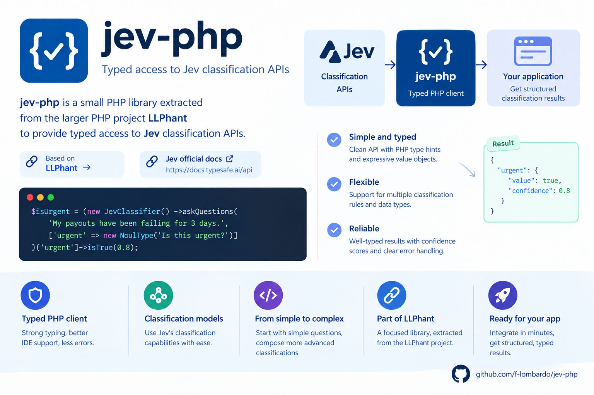

# jev-php




`jev-php` is a small PHP library extracted from the larger PHP project [LLPhant](https://github.com/LLPhant/LLPhant) to
provide typed access to [Jev](https://docs.typesafe.ai/api) classification APIs.

It focuses on a single use case: sending a state (typically text) and receiving structured answers through value objects
for:

- **Noul** (yes/no score)
- **Choice** (selected label + probabilities)
- **Score** (rubric-based graded output)

Every returned answer also includes Jev token usage metadata (`inputTokens`, `outputTokens`).

> [!IMPORTANT]
> **Unofficial project.** `jev-php` is community-built. It is not affiliated with, endorsed by, or
> sponsored by TypeSafe AI. "TypeSafe" and "Jev" belong to their owner. You need a TypeSafe API
> key to use it.

## Requirements

- PHP `^8.1`
- Composer
- A Jev API key

## Installation

```bash
composer require f-lombardo/jev-php
```

## Authentication

By default, `JevClassifier` reads the API key from `JEV_API_KEY`:

```bash
export JEV_API_KEY=your_api_key
```

You can also pass it explicitly via `JevConfig`.

## Laya decision engine

`JevClassifier` also supports [Laya](https://github.com/NandhaKishorM/laya) through [
`LayaConfig`](src/Classification/LayaConfig.php).

Set Laya environment variables:

```bash
export LAYA_API_KEY=your_laya_api_key
export LAYA_URL=https://your-laya-endpoint/v1/systemone
```

(`LAYA_API_KEY` is optional)

Then initialize the classifier with `LayaConfig`:

```php
use JevPHP\Classification\JevClassifier;
use JevPHP\Classification\LayaConfig;

$classifier = new JevClassifier(new LayaConfig());
```

See [Docker quickstart](https://github.com/NandhaKishorM/laya/blob/main/docs/docker.md) from Laya documentation for
starting a local docker instance of `laya-serve`, which exposes Laya using a Jev compatible API.

## Quick start

```php
<?php

use JevPHP\Classification\ChoiceType;
use JevPHP\Classification\JevClassifier;
use JevPHP\Classification\JevConfig;
use JevPHP\Classification\NoulType;
use JevPHP\Classification\ScoreCriteria;
use JevPHP\Classification\ScoreType;

$classifier = new JevClassifier();
// Or:
// $classifier = new JevClassifier(new JevConfig(apiKey: 'your_api_key'));

$questions = [
    'is_urgent' => new NoulType('Does this convey urgency?'),
    'department' => new ChoiceType(
        'Which team should handle this?',
        [
            'billing' => 'Payments, invoicing, refunds',
            'technical' => 'Bugs, outages, integrations',
            'sales' => 'Pricing, upgrades, new accounts',
        ]
    ),
    'frustration' => new ScoreType(
        'How frustrated is the customer?',
        new ScoreCriteria(['Calm', 'Frustrated', 'Very angry'])
    ),
];

$answers = $classifier->askQuestions(
    'Help! My payouts have been failing for 3 days.',
    $questions
);


/** @var JevPHP\Classification\NoulAnswer $isUrgent */
$isUrgent = $answers['is_urgent'];
$isUrgentValue = $isUrgent->isTrue();
$isProbablyUrgent = $isUrgent->isTrue(0.80);

/** @var JevPHP\Classification\ChoiceAnswer $department */
$department = $answers['department'];
$departmentChoice = $department->choice;
$departmentConfidence = $department->confidence;
$departmentProbabilities = $department->probabilities;

/** @var JevPHP\Classification\ScoreAnswer $frustrationScore */
$frustrationScore = $answers['frustration'];
$frustrationValue = $frustrationScore->score;
$frustrationConfidence = $frustrationScore->confidence;
$frustrationLegend = $frustrationScore->legend;
$frustrationProbabilities = $frustrationScore->probabilities;
```

## Question and answer types

### Noul

- **Question**: `NoulType`
- **Answer**: `NoulAnswer`
- Main field: `score` (`0..1`)
- Optional criteria object: `NoulCriteria`
- Helper method:
    - `isTrue(float $minTrueScore = 0.95): bool` returns `true` when `score >= $minTrueScore`.

Short snippet:

```php
$isUrgent = (new JevClassifier())->askQuestions(
    'My payouts have been failing for 3 days.',
    ['urgent' => new NoulType('Is this urgent?')]
)['urgent']->isTrue(0.8);
```

### Choice

- **Question**: `ChoiceType`
- **Answer**: `ChoiceAnswer`
- Main fields: `choice`, `probabilities`, `confidence`

### Score

- **Question**: `ScoreType`
- **Answer**: `ScoreAnswer`
- Main fields: `score`, `legend`, `probabilities`, `confidence`

`ScoreAnswer::score` is a probability-weighted numeric score across the provided levels.

## Usage metadata

All answer objects extend `Answer` and expose token usage for the request:

- `inputTokens`
- `outputTokens`

These values are copied from the top-level `usage` section returned by Jev.

## Configuration

`JevConfig` supports:

- `apiKey`
- `url` (default: `https://api.typesafe.ai/v1/systemone`)
- `model` (default: `jev-latest`)
- optional custom PSR-18 client / PSR-17 factories

## Development

This repository is designed to be developed and tested in Docker (host PHP is not required).

From `docker/`:

```bash
cp .env.dist .env
docker compose up -d
docker compose exec php composer install
```

Run quality checks inside the `php` container:

```bash
docker compose exec php composer test:lint
docker compose exec php composer test:types
docker compose exec php composer test:type-coverage
docker compose exec php composer test:unit
```

There's also a brief composer script you can run before committing your changes in order to be sure that base checks are
OK is `composer quality`:

```bash
docker compose exec php composer quality
```

Integration tests:

```bash
docker compose exec php composer test:int
```

## Reference documentation

- Jev API reference: <https://docs.typesafe.ai/api>
